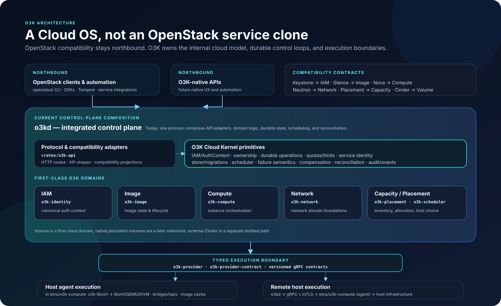
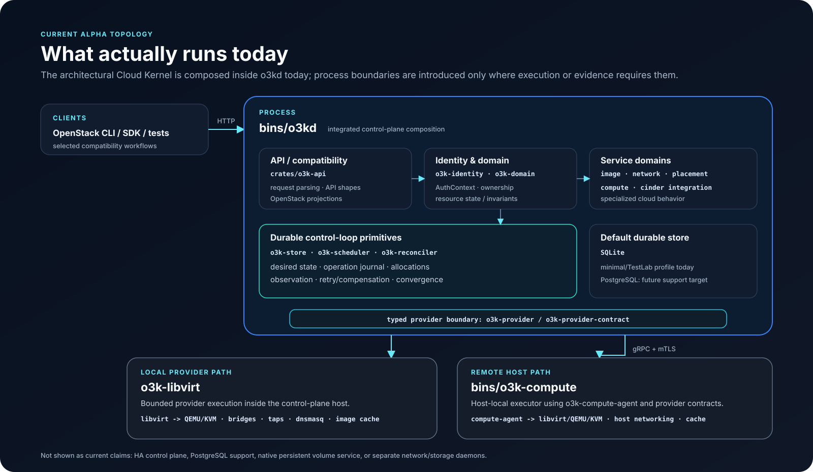
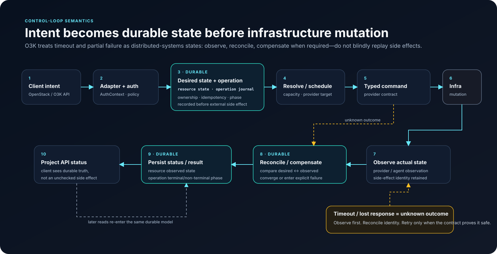

# O3K Cloud OS — Architecture Summary

> **O3K is a lightweight, open, Rust-native Cloud Operating System with an
> OpenStack-compatible northbound surface.**

The central design decision is simple: preserve useful OpenStack compatibility,
without making historical OpenStack service/process topology the internal
architecture of O3K.

## 1. Product architecture



The northbound compatibility mapping is:

```text
Keystone  -> O3K IAM
Glance    -> O3K Image
Nova      -> O3K Compute
Neutron   -> O3K Network
Placement -> O3K Capacity / Placement
Cinder    -> O3K Volume compatibility
```

Under those adapters, O3K owns a canonical cloud model and shared Cloud Kernel
semantics: principal identity, authorization context, resource ownership,
durable IDs, operations, scheduling, quotas/limits, audit/event identity,
failure semantics, compensation, and reconciliation.

Service/domain logic stays specialized. Infrastructure mutation crosses a typed
provider boundary.

## 2. Current runtime topology

The accepted architecture must not be confused with a claim that every
conceptual boundary already exists as an independent daemon.



Today:

- `bins/o3kd` composes the HTTP compatibility layer, identity/domain logic,
  durable state, scheduling, and reconciliation;
- SQLite is the supported minimal/TestLab store;
- direct local libvirt execution exists behind the provider boundary only
  through the `o3k-compute` host agent (the in-daemon direct libvirt path is
  deliberately fail-closed per ADR-0086);
- remote compute execution uses the `bins/o3k-compute` host agent
  (`o3k-compute-agent` crate) over gRPC + mTLS;
- native persistent Volume and separate native network/storage daemons are later
  milestones;
- external/hosted Cinder remains an independently authoritative service in the
  service-testbed profile.

`o3kd` is therefore a composition shell for the current release topology, not a
requirement that the future system become a monolith.

## 3. Durable authority flow



For an O3K-owned resource:

```text
client intent
-> compatibility/native adapter
-> AuthContext + authorization
-> durable desired state + operation identity
-> scheduling/provider resolution
-> typed provider command
-> bounded infrastructure mutation
-> observation
-> reconciliation / compensation
-> durable status projection
```

The provider does not become the source of public cloud identity or ownership.
The control plane remains authoritative for desired state and resource identity;
the provider is authoritative only for what it actually observed/executed.

A timeout is an **unknown outcome**, not proof that the side effect failed. O3K
must observe and reconcile before retrying an operation whose effect may already
have happened.

Today's authorization enforcement is Keystone-compatible token verification
with project-scoped isolation; the shared
`Principal × Action × Resource × Context` engine is the ADR-0166 convergence
target, not a shipped component.

## 4. O3K IAM and Keystone

O3K IAM is the canonical internal identity/authorization architecture. Keystone
is the OpenStack-compatible authentication/catalog projection where the selected
product profile requires it.

Conceptually, protected actions converge on:

```text
Principal × Action × Resource × Context -> Allow | Deny
```

The safety properties previously associated with Keystone integration remain:
validated authentication context, fail-closed behavior, tenant isolation,
service identity, and durable ID/name separation. They are O3K invariants rather
than reasons to make Keystone the internal topology.

## 5. Cloud Kernel boundary

The Cloud Kernel may contain only semantics that are genuinely shared across
first-class cloud domains. Examples include:

- IAM / service principals / authorization context;
- resource identity and ownership;
- durable operations and idempotency identity;
- service registry and API/catalog projections;
- quotas and limits;
- region/AZ identity;
- audit/event identity;
- failure and unknown-outcome semantics;
- compensation and reconciliation.

Compute boot semantics, image transformation, network behavior, and other
domain-specific rules stay in their services/domains. A shared kernel must reduce
reimplementation without becoming a dumping ground.

## 6. Infrastructure authority

For O3K-owned resources:

```text
O3K Cloud Kernel / domain
        |
        v
typed execution contract
        |
        v
libvirt / host agent / future native provider
```

An already-running OpenStack, vSphere/vCenter, Proxmox, KubeVirt, or public
cloud is not just another execution provider: it may already own scheduling,
quotas, policy, public identity, and lifecycle. Such integration requires a
future delegated/federated authority model.

## 7. Release honesty

The Cloud OS architecture does **not** change the current release gate.
`v0.2.0-alpha.1` remains a Rust-native OpenStack-compatible libvirt TestLab
alpha.

The architecture must not be presented as evidence for features that have not
been implemented and proved. In particular, it does not imply current support
for production HA, PostgreSQL, native persistent volumes, broad federation, or
complete OpenStack parity.

## Governing documents

- [Architecture](../ARCHITECTURE.md)
- [ADR-0165 — O3K Cloud Operating System and Cloud Kernel](../adr/ADR-0165-o3k-cloud-operating-system-and-cloud-kernel.md)
- [ADR-0166 — O3K IAM and Keystone compatibility boundary](../adr/ADR-0166-o3k-iam-and-keystone-compatibility-boundary.md)
- [SPEC-0020 — O3K IAM, Keystone compatibility, catalog, and authorization context](../specs/SPEC-0020-keystone-trust-catalog-and-auth-context.md)
- [SPEC-0024 — product profiles and claims](../specs/SPEC-0024-product-profiles-and-claims.md)
